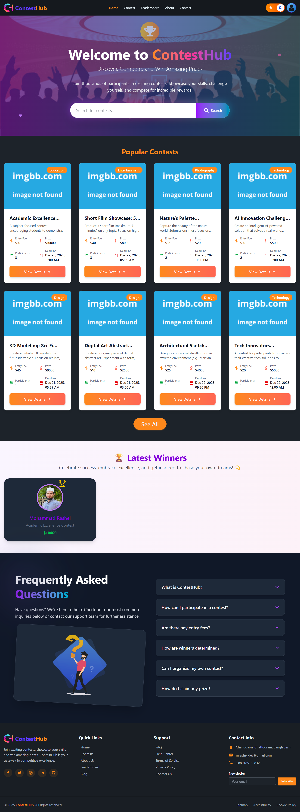
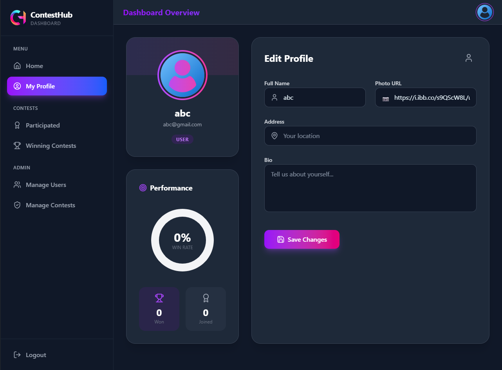

# 🏆 ContestHub - Premier Contest Platform



## 🚀 Overview

**ContestHub** is a dynamic and feature-rich platform designed to bridge the gap between contest organizers and creative participants. Whether you want to showcase your skills to win prizes or host a competition to find the best talent, ContestHub provides the tools you need. With a sleek, modern interface and robust functionality, it offers a seamless experience for Users, Creators, and Admins alike.

🔗 **Live Website:** [https://contest-hub-6496b.web.app/](https://contest-hub-6496b.web.app/)

---

## ✨ Key Features

-   **🔐 Secure Authentication:** Robust login and registration system powered by **Firebase**, supporting both Email/Password and Google Social Login.
-   **👥 Role-Based Dashboards:** tailored experiences for different user roles:
    -   **User:** Browse contests, participate, view winning history, and update profile.
    -   **Creator:** Create, update, and manage contests, view submissions, and declare winners.
    -   **Admin:** Manage users, approve/reject contests, and oversee platform activity.
-   **💳 Integrated Payments:** Seamless and secure contest entry fee payments using **Stripe** payment gateway.
-   **🎨 Modern & Responsive Design:** Built with **Tailwind CSS v4** and **DaisyUI**, ensuring a beautiful and accessible interface across all devices (Mobile, Tablet, Desktop).
-   **🌓 Dark Mode Support:** Fully integrated dark/light theme toggle for user preference.
-   **📊 Interactive Data Visualization:** Visual analytics of user performance and win rates using **Recharts**.
-   **⚡ Real-time Updates:** Efficient data fetching and caching with **TanStack Query** for a snappy user experience.
-   **🏆 Dynamic Leaderboard:** A competitive leaderboard highlighting top performers based on their contest wins and participation.
-   **🔍 Advanced Search & Sorting:** Easily find contests with search functionality and sort by popularity or deadline.
-   **✨ Engaging Animations:** Smooth transitions and interactive elements powered by **Motion** (Framer Motion) and **Lottie** animations.
-   **📝 Form Handling:** Robust form validation and handling using **React Hook Form**.
-   **🔔 Interactive Notifications:** Real-time feedback using **React Toastify** and **SweetAlert2** for actions like payments, submissions, and updates.

---

## 🛠️ Technology Stack

### Frontend

-   **React 19:** The core library for building the user interface.
-   **React Router 7:** For seamless client-side routing.
-   **Tailwind CSS 4 & DaisyUI 5:** For rapid, utility-first styling and pre-built components.
-   **Motion (Framer Motion):** For complex and fluid animations.
-   **TanStack Query:** For powerful asynchronous state management.
-   **Axios:** For making HTTP requests to the backend.

### Backend & Services

-   **Firebase:** For Authentication and Hosting.
-   **Node.js & Express:** (Server-side) For API handling.
-   **MongoDB:** (Database) For storing user, contest, and payment data.
-   **Stripe:** For processing payments.
-   **ImgBB:** For image hosting.

---

## 📸 Screenshots

### Admin Dashboard



---

## 🚀 Getting Started

Follow these steps to run the project locally on your machine.

### Prerequisites

-   Node.js installed (v16 or higher recommended)
-   npm or yarn package manager

### Installation

1.  **Clone the repository:**

    ```bash
    git clone https://github.com/your-username/contest-hub-client.git
    cd contest-hub-client
    ```

2.  **Install dependencies:**

    ```bash
    npm install
    ```

3.  **Set up Environment Variables:**
    Create a `.env` file in the root directory and add your Firebase and Stripe configuration keys:

    ```env
    VITE_API_KEY=your_firebase_api_key
    VITE_AUTH_DOMAIN=your_firebase_auth_domain
    VITE_PROJECT_ID=your_firebase_project_id
    VITE_STORAGE_BUCKET=your_firebase_storage_bucket
    VITE_MESSAGING_SENDER_ID=your_firebase_messaging_sender_id
    VITE_APP_ID=your_firebase_app_id
    VITE_IMAGE_HOST_KEY=your_imgbb_api_key
    VITE_STRIPE_PUBLISHABLE_KEY=your_stripe_publishable_key
    ```

4.  **Run the development server:**

    ```bash
    npm run dev
    ```

5.  **Open in Browser:**
    Navigate to `http://localhost:5173` to view the application.

---

## 🤝 Contributing

Contributions are welcome! If you have any ideas for improvements or find any bugs, please open an issue or submit a pull request.

---

## 📄 License

This project is licensed under the MIT License.
